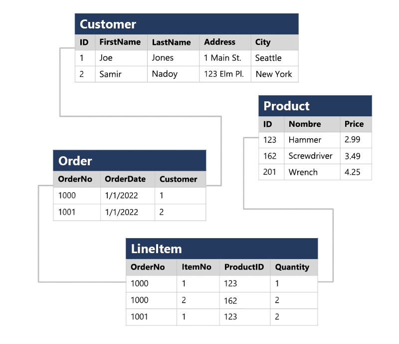
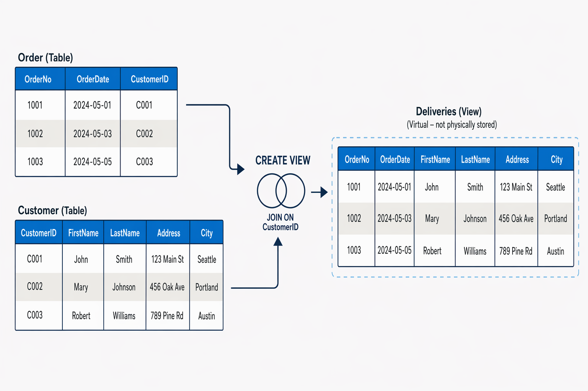

# 🌐 Exploración de los servicios de bases de datos relacionales en Azure
 
# Introducción
 
 
Cuando se empezaron a usar los sistemas informáticos, cada aplicación almacenaba los datos en su propia estructura, que era única. Cuando los desarrolladores querían crear aplicaciones para usar esos datos, necesitaban mucha información sobre la estructura de datos en particular para encontrar los que necesitaban. Estas estructuras de datos eran ineficaces, costosas de mantener y difíciles de optimizar para que la aplicación tuviera un buen rendimiento.
 
El modelo de base de datos relacional se diseñó para resolver el problema de varias estructuras de datos arbitrarias. El modelo relacional proporciona una forma estándar de representar y consultar datos que cualquier aplicación puede usar. Una de las principales ventajas del modelo de base de datos relacional es su uso de **tablas**, que son una manera intuitiva, eficaz y flexible de almacenar y acceder a la información estructurada.
 
El modelo relacional, sencillo pero eficaz, se usa en organizaciones de todo tipo y tamaño para satisfacer diferentes necesidades de administración de la información. Las bases de datos relacionales se utilizan para:
- Realizar un seguimiento de los inventarios.
- Procesar transacciones de comercio electrónico.
- Administrar grandes cantidades de información de clientes críticos.
- Y mucho más.
 
Las bases de datos relacionales son útiles para almacenar cualquier información que contenga elementos de datos relacionados que se deban organizar en una estructura coherente y basada en reglas.
 
En este módulo, obtendrá información sobre las características clave de las bases de datos relacionales y explorará las estructuras de datos relacionales.
 
---
 
# Comprensión de la normalización
 
La normalización es un término que usan los profesionales de bases de datos para un proceso de diseño de esquemas que minimiza la duplicación de datos y exige la integridad de los datos.
 
Aunque hay muchas reglas complejas que definen el proceso de refactorización de datos en varios niveles (o formas) de normalización, una definición sencilla con fines prácticos es:
 
- Separar cada entidad en su propia tabla.
- Separar cada atributo discreto en su propia columna.
- Identificar de forma única cada instancia de entidad (fila) mediante una clave principal.
- Usar columnas de clave externa para vincular entidades relacionadas.
 
## Ejemplo de datos sin normalizar
 
Para comprender los principios básicos de la normalización, supongamos que la siguiente tabla representa una hoja de cálculo que una empresa usa para realizar un seguimiento de sus ventas.
 
| N.º de pedido | NombreDelCliente | CustomerAddress        | ProductName | Precio por Unidad | Cant. |
|---------------|------------------|------------------------|-------------|-------------------|--------|
| 1 | Jane Smith | 42 Oak St.Seattle | Widget A | 9.99 | 2 |
| 1 | Jane Smith | 42 Oak St.Seattle | Widget B | 4.49 | 1 |
| 2 | Bob Jones  | 18 Pine Ave Portland | Widget A | 9.99 | 5 |
| 2 | Bob Jones  | 18 Pine Ave Portland | Gadget X | 24,99 | 1 |
| 3 | Jane Smith | 42 Oak St.Seattle | Gadget X | 24,99 | 3 |
| 3 | Jane Smith | 42 Oak St.Seattle | Widget B | 4.49 | 2 |
 
*Ejemplo de hoja de cálculo utilizada para registrar ventas.*
 
Observe que los detalles del cliente y del producto se duplican para cada artículo individual vendido. Además, el nombre del cliente y la dirección postal, así como el nombre y el precio del producto, se combinan en las mismas celdas de la hoja de cálculo.
 
## Aplicando la normalización
 
Ahora veamos cómo cambia la normalización la forma en que se almacenan los datos.
 

 
*Diagrama en el que se muestran datos de orden en un esquema tabular normalizado.*
 
Cada entidad representada en los datos (**cliente**, **producto**, **pedido de ventas** y **elemento de línea**) se almacena en su propia tabla y cada atributo discreto de esas entidades se encuentra en su propia columna.
 
La grabación de cada instancia de una entidad como una fila en una tabla específica de la entidad elimina la duplicación de datos. Por ejemplo, para cambiar la dirección de un cliente, solo necesita modificar el valor en una sola fila.
 
La descomposición de los atributos en columnas individuales garantiza que cada valor esté restringido a un tipo de datos adecuado. Por ejemplo:
 
- Los precios de los productos deben ser valores decimales.
- Las cantidades de elementos de línea deben ser números enteros.
 
Además, la creación de columnas individuales proporciona un nivel útil de granularidad en los datos para realizar consultas. Por ejemplo, puede filtrar fácilmente a los clientes para mostrar únicamente aquellos que viven en una ciudad específica.
 
---
 
# Exploración de SQL
 
## Claves principales y claves externas
 
Las instancias de cada entidad se identifican de forma única mediante un identificador u otro valor de clave, conocido como **clave principal**.
 
Cuando una entidad hace referencia a otra (por ejemplo, un pedido tiene un cliente asociado), la clave principal de la entidad relacionada se almacena como una **clave externa**.
 
Por ejemplo, puede buscar la dirección del cliente (que se almacena solo una vez) para cada registro de la tabla `Order` haciendo referencia al registro correspondiente en la tabla `Customer`.
 
Normalmente, un sistema de administración de bases de datos relacionales (**RDBMS**) puede aplicar **integridad referencial** para asegurarse de que un valor especificado en un campo de clave externa tiene una clave principal correspondiente existente en la tabla relacionada. Esto permite, por ejemplo, evitar pedidos para clientes inexistentes.
 
## Claves compuestas
 
En algunos casos, una clave (principal o externa) se puede definir como una **clave compuesta**, basada en una combinación única de varias columnas.
 
Por ejemplo, la tabla `LineItem` del ejemplo anterior utiliza una combinación única de:
 
- `OrderNo`
- `ItemNo`
 
para identificar un elemento de línea de un pedido individual.
 
De esta manera, cada producto dentro de un pedido puede identificarse de forma única sin necesidad de crear un identificador adicional.
 
---
 
# Exploración de SQL
 
SQL (**Structured Query Language**) es el lenguaje estándar para comunicarse con bases de datos relacionales.
 
Se utiliza para:
 
- Consultar datos
- Insertar datos
- Actualizar datos
- Eliminar datos
- Crear y modificar estructuras de bases de datos
 
---
 
## Sistemas que usan SQL
 
| Sistema | Descripción |
|----------|-------------|
| Microsoft SQL Server | Motor de base de datos de Microsoft |
| Azure SQL Database | Base de datos en la nube de Azure |
| Azure SQL Managed Instance | Versión gestionada en Azure |
| SQL Server en Azure VMs | SQL Server en máquinas virtuales |
| MySQL | Base de datos open-source muy usada |
| PostgreSQL | Sistema avanzado open-source |
| Oracle | Sistema empresarial muy potente |
 
---
 
## Estándar SQL
 
| Año | Organización | Evento |
|-----|--------------|--------|
| 1986 | ANSI | Primera estandarización de SQL |
| 1987 | ISO | Estándar internacional |
 
📌 Desde entonces, SQL ha evolucionado con extensiones propias de cada fabricante.
 
---
 
## Dialectos de SQL
 
| Dialecto | Uso principal |
|----------|--------------|
| T-SQL | Microsoft SQL Server / Azure |
| PL/pgSQL | PostgreSQL |
| PL/SQL | Oracle |
 
---
 
# Tipos de instrucciones SQL
 
| Tipo | Nombre | Función |
|------|--------|---------|
| DDL | Data Definition Language | Define estructuras (tablas, vistas) |
| DCL | Data Control Language | Controla permisos |
| DML | Data Manipulation Language | Manipula datos |
 
---
 
# DDL (Definición de datos)
 
## Instrucciones DDL
 
| Comando | Descripción |
|---------|------------|
| CREATE | Crear objetos (tablas, vistas) |
| ALTER | Modificar estructuras |
| DROP | Eliminar objetos |
| RENAME | Cambiar nombre |
 
---
 
## ⚠️ Advertencia
 
| Comando | Riesgo |
|----------|--------|
| DROP | Elimina toda la tabla y sus datos de forma permanente |
 
---
 
## Ejemplo CREATE TABLE
 
```sql
CREATE TABLE Product
(
    ID INT PRIMARY KEY,
    Name VARCHAR(20) NOT NULL,
    Price DECIMAL NULL
);
```
 
---
 
## Tipos de datos
 
| Tipo | Descripción |
|------|-------------|
| INT | Número entero |
| DECIMAL | Número decimal |
| VARCHAR | Texto de longitud variable |
 
---
 
## Conceptos clave
 
| Elemento | Significado |
|-----------|-------------|
| NOT NULL | Campo obligatorio |
| NULL | Campo vacío permitido |
| PRIMARY KEY | Identificador único |
 
---
 
# DCL (Control de datos)
 
## Comandos DCL
 
| Comando | Función |
|---------|--------|
| GRANT | Concede permisos |
| DENY | Deniega permisos |
| REVOKE | Revoca permisos |
 
---
 
## Ejemplo GRANT
 
```sql
GRANT SELECT, INSERT, UPDATE
ON Product
TO user1;
```
 
---
 
# DML (Manipulación de datos)
 
## Comandos DML
 
| Comando | Función |
|---------|--------|
| SELECT | Leer datos |
| INSERT | Insertar datos |
| UPDATE | Modificar datos |
| DELETE | Eliminar datos |
 
---
 
## SELECT
 
| Tipo | Ejemplo |
|------|--------|
| Todos los datos | `SELECT * FROM Customer;` |
| Columnas específicas | `SELECT FirstName, City FROM Customer;` |
 
---
 
## SELECT con filtro
 
```sql
SELECT *
FROM Customer
WHERE City = 'Seattle';
```
 
---
 
## ORDER BY
 
```sql
SELECT FirstName, LastName, City
FROM Customer
ORDER BY LastName;
```
 
---
 
## JOIN
 
| Elemento | Función |
|----------|--------|
| o | Alias de Order |
| c | Alias de Customer |
 
```sql
SELECT o.OrderNo, o.OrderDate, c.Address, c.City
FROM Order AS o
JOIN Customer AS c
ON o.Customer = c.ID;
```
 
---
 
## UPDATE ⚠️
 
| Caso | Resultado |
|------|----------|
| Con WHERE | Actualiza filas específicas |
| Sin WHERE | Actualiza TODA la tabla |
 
```sql
UPDATE Customer
SET Address = '123 High St.'
WHERE ID = 1;
```
 
---
 
## DELETE ⚠️
 
| Caso | Resultado |
|------|----------|
| Con WHERE | Elimina filas específicas |
| Sin WHERE | Elimina TODA la tabla |
 
```sql
DELETE FROM Product
WHERE ID = 162;
```
 
---
 
## INSERT
 
```sql
INSERT INTO Product(ID, Name, Price)
VALUES (99, 'Drill', 4.99);
```
 
---
 
## Nota final
 
| Tema | Importante |
|------|------------|
| INSERT | Normalmente inserta una fila |
| SQL | No pide confirmación en DELETE o UPDATE |
| Dialecto | Este módulo usa T-SQL |
 
---
 
# Descripción de objetos de base de datos
 
Además de las tablas, una base de datos relacional puede contener otras estructuras que ayudan a:
 
- Optimizar la organización de los datos  
- Encapsular acciones mediante programación  
- Mejorar la velocidad de acceso  
 
En esta unidad veremos:
 
- Vistas  
- Procedimientos almacenados  
- Índices  
 
---
 
# ¿Qué es una vista?
 
Una **vista** es una tabla virtual basada en el resultado de una consulta `SELECT`.
 
Se puede entender como una “ventana” que muestra datos de una o varias tablas.
 
---
 
## Ejemplo de creación de vista
 
```sql
CREATE VIEW Deliveries
AS
SELECT o.OrderNo, o.OrderDate,
       c.FirstName, c.LastName, c.Address, c.City
FROM Order AS o
JOIN Customer AS c
ON o.Customer = c.ID;
```
 
---
 
## Diagrama de vista
 

 
---
 
## Consulta sobre la vista
 
```sql
SELECT OrderNo, OrderDate, LastName, Address
FROM Deliveries
WHERE City = 'Seattle';
```
 
---
 
# ¿Qué es un procedimiento almacenado?
 
Un **procedimiento almacenado** es un conjunto de instrucciones SQL guardadas en la base de datos que se pueden ejecutar cuando se necesiten.
 
Sirve para:
 
- Reutilizar lógica
- Automatizar tareas
- Encapsular procesos en la base de datos
 
---
 
## Ejemplo
 
```sql
CREATE PROCEDURE RenameProduct
    @ProductID INT,
    @NewName VARCHAR(20)
AS
UPDATE Product
SET Name = @NewName
WHERE ID = @ProductID;
```
 
---
 
## Ejecución
 
```sql
EXEC RenameProduct 201, 'Spanner';
```
 
---
 
# ¿Qué es un índice?
 
Un **índice** mejora la velocidad de búsqueda en una tabla.
 
Se puede comparar con el índice de un libro:
 
- Permite encontrar datos rápidamente  
- Evita leer toda la tabla  
- Mejora el rendimiento de consultas  
 
---
 
## Creación de índice
 
```sql
CREATE INDEX idx_ProductName
ON Product(Name);
```
 
---
 
## Diagrama de índice
 

 
---
 
## Funcionamiento
 
Un índice:
 
- Crea una estructura ordenada (tipo árbol)
- Apunta a filas de la tabla
- Permite búsquedas más rápidas
 
---
 
## Ventajas y desventajas
 
| Ventajas | Desventajas |
|----------|-------------|
| Búsquedas más rápidas | Ocupa espacio |
| Mejora consultas SELECT | Ralentiza INSERT |
| Optimiza rendimiento | Requiere mantenimiento |
 
---
 
## Nota final
 
Puedes crear varios índices en una tabla, pero siempre debes equilibrar:
 
- Velocidad de consulta  
- Coste de mantenimiento

# 🔍 Exploración de conceptos fundamentales de datos relacionales
 
# Introducción


Azure admite varios servicios de base de datos, lo que permite ejecutar en la nube diversos sistemas de administración de bases de datos relacionales conocidos, como SQL Server, PostgreSQL y MySQL.

La mayoría de los servicios de base de datos de Azure están totalmente administrados, lo que reduce el tiempo dedicado a tareas de administración. Además, ofrecen rendimiento de nivel empresarial, alta disponibilidad integrada, escalado rápido y distribución global.

Los desarrolladores pueden aprovechar:

- Seguridad integrada con supervisión automática.
- Detección automática de amenazas.
- Ajuste automático para mejorar el rendimiento.

Además, la disponibilidad está garantizada.

## Objetivo del módulo

Explorar las opciones disponibles para los servicios de bases de datos relacionales en Azure.

---

# Descripción de los servicios y las capacidades de Azure SQL

Azure SQL es un término colectivo que hace referencia a una familia de servicios de bases de datos basados en Microsoft SQL Server en Azure.

## Servicios de Azure SQL

### SQL Server en Azure Virtual Machines (VMs)

Máquina virtual que se ejecuta en Azure con SQL Server instalado.

**Características:**

- Solución de infraestructura como servicio (IaaS).
- Virtualiza la infraestructura de hardware para proceso, almacenamiento y redes en Azure.
- Permite un mayor control sobre el sistema operativo y la configuración del servidor.
- Excelente opción para migraciones *lift-and-shift* de entornos locales de SQL Server a la nube.

### Azure SQL Managed Instance

Opción de plataforma como servicio (PaaS) que proporciona una compatibilidad casi completa con instancias locales de SQL Server.

**Características:**

- Abstrae el hardware y el sistema operativo subyacentes.
- Administración automatizada de actualizaciones de software.
- Copias de seguridad automáticas.
- Tareas de mantenimiento automatizadas.
- Reduce la carga administrativa asociada a la gestión de una instancia de base de datos.

### Azure SQL Database

Servicio de base de datos PaaS totalmente administrado y altamente escalable diseñado para la nube.

**Características:**

- Incluye las capacidades principales de SQL Server local.
- Alta escalabilidad.
- Administración completamente gestionada.
- Ideal para desarrollar aplicaciones nativas de la nube.

## Comparación de los servicios de Azure SQL


| Característica | SQL Server en Azure Virtual Machines | Azure SQL Managed Instance | Azure SQL Database |
|---------------|--------------------------------------|----------------------------|-------------------|
| **Tipo de servicio en la nube** | IaaS | PaaS (Plataforma como Servicio) | PaaS (Plataforma como Servicio) |
| **Compatibilidad con SQL Server** | Totalmente compatible con instalaciones físicas y virtualizadas locales. Las aplicaciones y bases de datos se pueden migrar fácilmente mediante el enfoque *lift-and-shift* sin realizar cambios. | Casi completamente compatible con SQL Server. La mayoría de las bases de datos locales se pueden migrar con cambios mínimos de código mediante Azure Database Migration Service. | Admite la mayoría de las funcionalidades básicas de SQL Server. Algunas características de las que dependa una aplicación local podrían no estar disponibles. |
| **Arquitectura** | Las instancias de SQL Server se instalan en una máquina virtual. Cada instancia puede admitir varias bases de datos. | Cada instancia administrada puede admitir varias bases de datos. Los grupos de instancias permiten compartir recursos de forma eficiente entre instancias más pequeñas. | Puede aprovisionar una base de datos única en un servidor lógico administrado o utilizar grupos elásticos para compartir recursos entre varias bases de datos y aprovechar la escalabilidad bajo demanda. |
| **Disponibilidad** | 99,99 % | 99,99 % | 99,995 % |
| **Administración** | Debe administrar todos los aspectos del servidor, incluidos el sistema operativo, SQL Server, la configuración, las copias de seguridad y otras tareas de mantenimiento. | Actualizaciones, copias de seguridad y recuperación totalmente automatizadas. | Actualizaciones, copias de seguridad y recuperación totalmente automatizadas. |
| **Casos de uso** | Ideal para migrar o ampliar una solución de SQL Server local conservando el control total sobre la configuración del servidor y la base de datos. | Adecuado para la mayoría de los escenarios de migración a la nube, especialmente cuando se requieren cambios mínimos en las aplicaciones existentes. | Recomendado para nuevas soluciones en la nube o para migrar aplicaciones con dependencias mínimas de instancia. |

## SQL Server en Azure Virtual Machines

SQL Server en Azure Virtual Machines permite usar versiones completas de SQL Server en la nube sin necesidad de administrar hardware local. Representa un enfoque de Infraestructura como Servicio (IaaS).

### Características principales

- Replica el entorno de SQL Server que se ejecuta en hardware local.
- Facilita migraciones mediante el enfoque *lift-and-shift*.
- Permite acceso a funcionalidades del sistema operativo no disponibles en soluciones PaaS.
- Adecuado para entornos híbridos.
- Proporciona control administrativo total sobre el sistema operativo y SQL Server.

### Casos de uso

- Migraciones rápidas a la nube con cambios mínimos.
- Extensión de aplicaciones locales a la nube.
- Entornos de desarrollo y pruebas.
- Escenarios que requieren control completo del sistema.

### Ventajas empresariales

- Utiliza las mismas herramientas y conocimientos que SQL Server local.
- Reduce el impacto de la migración.
- Permite mantener requisitos específicos que podrían no ser compatibles con servicios totalmente administrados.
- Conserva el control completo sobre la configuración del servidor y la base de datos.

## Azure SQL Managed Instance

Azure SQL Managed Instance proporciona una instancia de SQL Server altamente compatible con entornos locales, pero con muchas tareas administrativas automatizadas.

### Características principales

- Compatibilidad casi completa con SQL Server local.
- Permite alojar múltiples bases de datos en una misma instancia.
- Automatiza:
  - Copias de seguridad.
  - Aplicación de revisiones.
  - Supervisión.
  - Tareas de mantenimiento.
- Mantiene el control sobre seguridad y asignación de recursos.

### Integración con Azure

Utiliza diversos servicios de Azure, entre ellos:

- Azure Storage.
- Azure Event Hubs.
- Microsoft Entra ID.
- Azure Key Vault.

### Seguridad

- Comunicaciones cifradas y firmadas mediante certificados.
- Verificación continua de certificados.
- Cierre automático de conexiones ante certificados revocados.

### Casos de uso

- Migraciones *lift-and-shift* de instancias completas de SQL Server.
- Sistemas que utilizan:
  - Linked Servers.
  - Service Broker.
  - Database Mail.

### Ventajas empresariales

- Reduce significativamente las tareas administrativas.
- Compatibilidad casi total con SQL Server Enterprise Edition.
- Soporta autenticación mediante:
- SQL Server Authentication.
- Microsoft Entra ID.

## Azure SQL Database

Azure SQL Database es una solución PaaS totalmente administrada para bases de datos SQL en la nube.

### Modalidades disponibles

#### Base de datos única

- Implementación rápida de una base de datos individual.
- Escalado bajo demanda.
- Opciones dedicadas o sin servidor (*serverless*).
- Facturación según recursos utilizados.

#### Grupo elástico

- Varias bases de datos comparten recursos comunes.
- Optimiza costes.
- Adecuado para cargas de trabajo variables.

### Casos de uso

- Aplicaciones nativas de la nube.
- Sistemas con alta disponibilidad.
- Aplicaciones con cargas variables.
- Nuevos proyectos cloud.

### Ventajas empresariales

- Actualizaciones automáticas.
- Aplicación automática de revisiones de seguridad.
- Escalabilidad dinámica.
- Alta disponibilidad (99,995 %).
- Restauración a un punto en el tiempo.
- Replicación geográfica.
- Recuperación ante desastres.

### Seguridad

#### Advanced Threat Protection

- Evaluación de vulnerabilidades.
- Detección de actividades sospechosas.
- Alertas de seguridad automáticas.
- Protección frente a ataques de inyección SQL.

#### Auditoría

- Registro de eventos de base de datos.
- Soporte para cumplimiento normativo.
- Detección de anomalías y posibles incidentes de seguridad.

#### Cifrado

- Protección de datos en reposo.
- Protección de datos en tránsito.

---

## Descripción de los servicios de Azure para bases de datos de código abierto

Además de los servicios de Azure SQL, Azure ofrece servicios de bases de datos relacionales para sistemas populares de código abierto como MySQL y PostgreSQL. Estos servicios permiten migrar aplicaciones existentes a Azure con cambios mínimos.

### ¿Qué son MySQL y PostgreSQL?

#### MySQL

MySQL es un sistema de administración de bases de datos relacionales de código abierto ampliamente utilizado en aplicaciones web.

**Características principales:**

- Base de datos relacional de código abierto.
- Componente habitual de la pila LAMP (Linux, Apache, MySQL y PHP).
- Disponible para Linux y Windows.
- Disponible en varias ediciones:
  - Community.
  - Standard.
  - Enterprise.

**Ediciones:**

| Edición | Descripción |
|----------|------------|
| Community | Gratuita y orientada a proyectos de código abierto y aplicaciones web. |
| Standard | Ofrece mejoras de rendimiento y tecnologías avanzadas de almacenamiento. |
| Enterprise | Incluye herramientas avanzadas de seguridad, disponibilidad y escalabilidad. |

#### PostgreSQL

PostgreSQL es una base de datos híbrida objeto-relacional que combina características relacionales tradicionales con capacidades avanzadas.

**Características principales:**

- Soporte para tipos de datos personalizados.
- Arquitectura extensible mediante módulos.
- Capacidad para almacenar y procesar datos geométricos.
- Soporte para procedimientos almacenados.
- Utiliza el lenguaje de consulta **pgsql**, una extensión de SQL.

## Azure Database for MySQL

Azure Database for MySQL es una implementación PaaS basada en la edición Community de MySQL.

### Características principales

- Alta disponibilidad integrada.
- Escalabilidad bajo demanda.
- Copias de seguridad automáticas.
- Restauración a un momento determinado.
- Seguridad mediante firewall y SSL.
- Administración completamente gestionada por Azure.

### Ventajas

- Alta disponibilidad.
- Rendimiento predecible.
- Escalado rápido.
- Protección de datos en reposo y en tránsito.
- Restauración de hasta 35 días.
- Seguridad empresarial.
- Cumplimiento normativo.
- Modelo de pago por uso.
- Supervisión mediante métricas, registros y alertas.

### Azure Database for MySQL: servidor flexible

La modalidad **Servidor Flexible** proporciona:

- Mayor control administrativo.
- Configuración más granular.
- Optimización de costos.
- Recomendado para nuevas cargas de trabajo.

## Azure Database for PostgreSQL

Azure Database for PostgreSQL es una implementación PaaS de PostgreSQL en Azure.

### Características principales

- Alta disponibilidad.
- Escalabilidad.
- Seguridad integrada.
- Administración automatizada.
- Compatibilidad con herramientas PostgreSQL existentes.

### Limitaciones

Algunas extensiones disponibles en instalaciones locales no están disponibles en Azure.

Las restricciones afectan principalmente a:

- Extensiones personalizadas.
- Procedimientos almacenados en lenguajes distintos de pgsql.
- Interacciones directas con el sistema operativo.

### Servidor flexible para PostgreSQL

La modalidad **Servidor Flexible** proporciona:

- Configuración avanzada del servidor.
- Mayor capacidad de personalización.
- Optimización de costos.
- Administración totalmente gestionada.

### Ventajas

- Detección automática de fallos.
- Conmutación por error integrada.
- Compatibilidad con pgAdmin.
- Administración simplificada.
- Alta disponibilidad.

### Supervisión y optimización

Azure Database for PostgreSQL incluye:

- Registro de consultas ejecutadas.
- Base de datos interna `azure_sys`.
- Vista `query_store.qs_view` para análisis de rendimiento.
- Herramientas para optimizar consultas y supervisar la actividad de usuarios.
